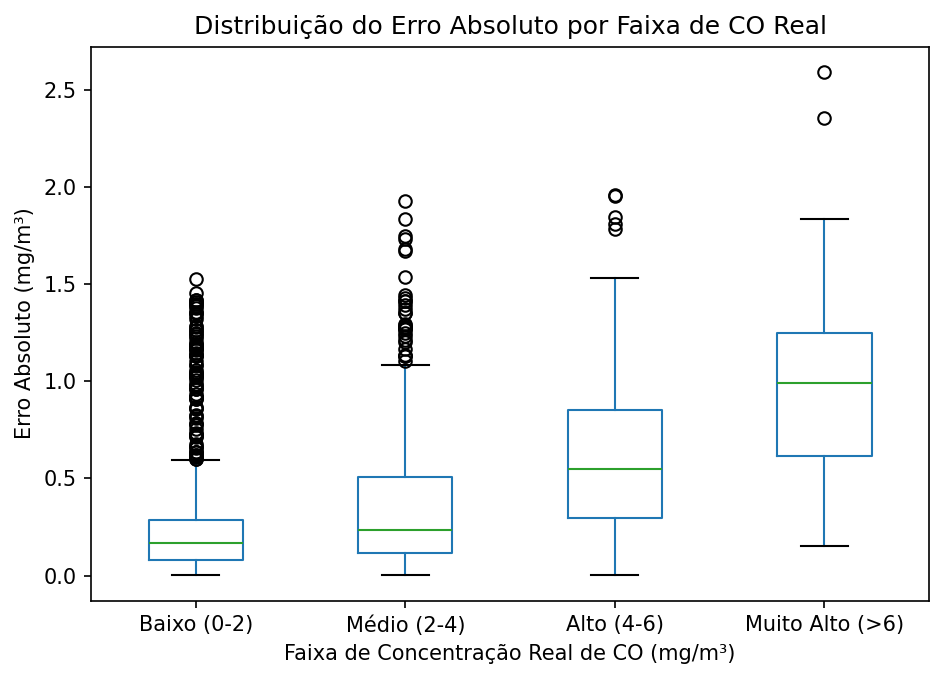
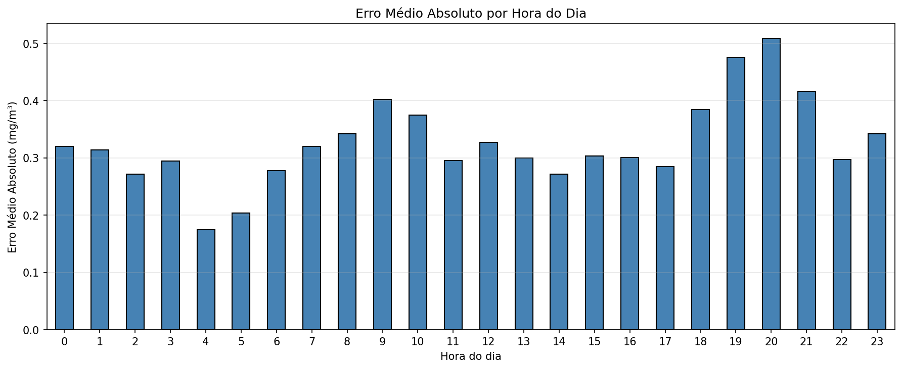
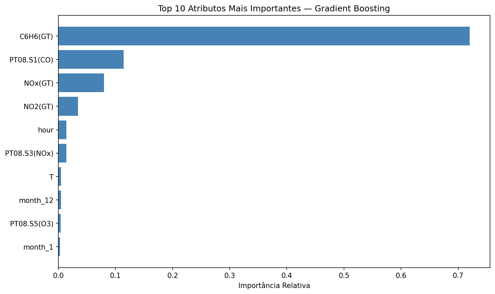

# Milestone 4 — Relatório de Conclusão e Entrega de Valor

## 1. Síntese de Resultados e Impacto

### O Problema Resolvido

Na Milestone 1 propusemo-nos a desenvolver um modelo de regressão que conseguisse prever a concentração horária de monóxido de carbono `CO(GT)` em ambiente urbano, com pelo menos 15% de melhoria no RMSE em relação a um modelo de referência simples. Quando começámos, este valor parecia-nos ambicioso porque não sabíamos bem o que esperar dos dados.

No final, o modelo Gradient Boosting otimizado reduziu o RMSE em 64.6% face ao baseline, ou seja, mais de quatro vezes acima do objetivo inicial. Sinceramente não estávamos à espera de conseguir um resultado assim tão acima do que tínhamos definido, e isso foi uma das coisas que mais nos motivou no projeto.

### Interpretação dos Resultados

Em vez de falar em termos técnicos, podemos explicar o que o modelo faz de forma simples: a partir das leituras dos sensores e das condições meteorológicas de um determinado momento, consegue estimar com bastante precisão qual a concentração de monóxido de carbono no ar nesse instante.

A margem de erro média das previsões é de apenas 0.32 mg/m³, o que é um valor muito baixo se pensarmos que a OMS define como limite máximo de exposição 10 mg/m³ (média de 8 horas). O modelo explica cerca de 87% da variabilidade do CO no ar, ou seja, capta a maior parte dos fatores que influenciam essa concentração.

Da análise dos erros que fizemos no notebook de interpretação, percebemos algo que nos pareceu muito importante: mais de 70% das previsões têm um erro inferior a 0.5 mg/m³. Isto é uma forma muito mais concreta de comunicar a fiabilidade do que falar só em RMSE.

### Valor para o Utilizador

Com este tipo de solução, uma entidade responsável pela monitorização da qualidade do ar conseguia antecipar situações de poluição elevada antes destas serem confirmadas pelos analisadores de referência, que são equipamentos mais caros e mais lentos. Isto permitia ações de prevenção mais rápidas, como avisos à população sensível, ajustes em sistemas de tráfego ou ativação de medidas de mitigação ambiental.

Em zonas urbanas onde a saúde pública é uma preocupação real, esta capacidade de antecipação tem um valor prático evidente. Foi um dos pontos que nos fez perceber que o trabalho não era só uma exercício académico, podia mesmo ter aplicações reais.

---

## 2. Análise Crítica e Limitações

### Limitações dos Dados

O dataset cobre apenas um ano de medições (março de 2004 a fevereiro de 2005) numa zona urbana específica de uma cidade italiana. Isto é uma limitação importante que reconhecemos: o modelo aprendeu padrões muito específicos daquele contexto e daquele período, e não temos como garantir que funcione igualmente bem noutras cidades, noutros climas ou em anos com características diferentes.

Outra limitação foi a perda da variável `NMHC(GT)`, que tivemos de remover por ter cerca de 90% de valores em falta. Esta variável poderia ter dado informação útil sobre os hidrocarbonetos não-metânicos e talvez ter melhorado o modelo, mas com tantos nulos não era viável mantê-la.

### Limitações do Modelo

A análise que fizemos no notebook de interpretação mostrou claramente onde o modelo é menos fiável.

Como se vê no gráfico, o modelo perde precisão à medida que a concentração real de CO aumenta. Para valores entre 0 e 2 mg/m³ (que correspondem à maioria dos casos), o erro é muito baixo. Para valores acima de 6 mg/m³, o erro cresce bastante. Isto significa que precisamente nos episódios de poluição mais grave, que são aqueles que mais importava prever bem, o modelo é menos fiável. Esta é a principal limitação que identificámos e que consideramos importante comunicar.

A análise por hora do dia também trouxe conclusões interessantes:

O modelo apresenta erros mais elevados nas horas de ponta (manhã e início da noite), o que faz sentido porque são os períodos de maior tráfego urbano e maior variabilidade da concentração de CO. Nas horas da madrugada, em que a poluição é mais estável e baixa, o modelo é claramente mais preciso.

### Contextos de Falha

Concluímos também que o modelo não deve ser usado em situações em que as condições ambientais ou as fontes de poluição sejam muito diferentes das presentes no dataset original. Por exemplo, num cenário com tráfego muito mais intenso, com fontes industriais distintas ou em climas muito diferentes do clima mediterrânico italiano, percebemos que o modelo provavelmente perderia bastante desempenho.

Também concluímos que não é adequado para previsões a longo prazo. Treinámo-lo para prever o CO no momento atual com base em leituras simultâneas dos sensores, não para prever o que vai acontecer daqui a vários dias.

---

## 3. Considerações Éticas e de Viés

### Privacidade

O dataset utilizado é composto exclusivamente por medições ambientais recolhidas por equipamentos automáticos, sem qualquer dado pessoal identificável. Não existem, portanto, implicações de privacidade nem questões de conformidade com o RGPD. Esta era uma das vantagens deste dataset que nos chamou a atenção logo no início.

### Transparência

Utilizámos técnicas de Feature Importance para perceber quais as variáveis com maior peso nas decisões do modelo. Isto significa que o modelo não funciona como uma caixa negra, conseguimos explicar de forma clara o que está por detrás das previsões.

O que ficámos contentes de ver é que as variáveis identificadas como mais importantes fazem todo o sentido do ponto de vista do problema: o benzeno `C6H6(GT)`, o sensor `PT08.S1(CO)` (que mede diretamente o CO), os óxidos de azoto `NOx(GT)` e a hora do dia. São precisamente as variáveis que faria sentido um especialista em qualidade do ar destacar. Isto dá-nos confiança de que o modelo está mesmo a aprender a realidade do problema e não padrões estranhos.

### Viés dos Dados

Como o modelo foi treinado com dados de uma única localização e de um único ano, existe um viés geográfico e temporal evidente. Aplicar este modelo noutros contextos sem reavaliação podia gerar previsões enviesadas que não refletiriam a realidade local. Qualquer utilização real do modelo teria de passar primeiro por validação com dados do contexto onde vai ser aplicado.

### Impacto de uma Utilização Real

Se um modelo deste tipo fosse usado para emitir alertas à população ou para apoiar decisões de saúde pública, um erro nas previsões (sobretudo nos casos extremos onde já sabemos que o modelo é menos fiável) podia ter consequências reais. Por isso, achamos que qualquer aplicação prática teria sempre de ser acompanhada de validação humana e nunca substituir completamente os analisadores de referência certificados. O modelo deve ser visto como uma ferramenta de apoio, não como uma decisão final.

---

## 4. Roadmap e Trabalhos Futuros

Esta foi uma das partes mais interessantes de pensar, porque nos obrigou a olhar para o trabalho com sentido crítico e a perceber o que ainda se podia fazer.

### 1. Melhoria Técnica

Gostaríamos de implementar técnicas específicas para melhorar a previsão dos valores extremos de CO, que é onde o modelo atualmente falha mais. Algumas hipóteses que pesquisámos incluem o uso de algoritmos como o XGBoost ou o LightGBM, a aplicação de quantile regression para captar melhor os extremos da distribuição, ou explorar redes neuronais recorrentes (LSTM) que aproveitem a componente temporal dos dados de forma mais explícita.

### 2. Novas Variáveis e Mais Dados

Gostaríamos de recolher dados de outras cidades e de períodos temporais mais alargados para tornar o modelo mais generalizável. Faria também sentido integrarmos variáveis adicionais como dados de tráfego em tempo real, indicadores de atividade industrial, previsões meteorológicas (vento e precipitação que influenciam muito a dispersão dos poluentes), médias móveis e diferenças entre leituras consecutivas para captarmos dinâmicas temporais de curto prazo.

### 3. Escalabilidade e Deployment

Gostaríamos de colocar o modelo em produção através de uma interface web simples (com Streamlit ou Dash) onde qualquer pessoa pudesse introduzir as leituras dos sensores e obter uma previsão imediata. A solução podia também ser integrada num sistema de monitorização contínua com alertas automáticos sempre que a previsão ultrapassasse um determinado limiar definido pelas autoridades de saúde pública.

### 4. Atualização Periódica do Modelo

Queríamos também criar um sistema de retreino periódico do modelo com novos dados, de forma a lidar com a possível deriva do conceito (concept drift). Os padrões de poluição podem mudar ao longo do tempo devido a alterações no tráfego, na indústria ou nas políticas ambientais, e percebemos que o modelo teria de acompanhar essas mudanças para continuar a ser útil.

---

## Conclusão Final

Olhando para trás, este projeto permitiu-nos passar por todas as fases de um ciclo completo de Ciência de Dados, desde a definição de um problema com relevância real até à entrega de uma solução validada e interpretável. Para além das competências técnicas que adquirimos com o código e com os modelos, aquilo que mais valorizamos foi perceber que cada decisão que tomámos ao longo do processo (desde a forma como tratámos os dados em falta até à escolha do modelo final) teve impacto direto naquilo que conseguimos entregar.

A solução que desenvolvemos não substitui os equipamentos profissionais de monitorização, isso é uma certeza. Mas demonstra que é possível usar dados de sensores de baixo custo, em conjunto com técnicas adequadas de modelação, para construir ferramentas com utilidade prática na gestão da qualidade do ar urbano. E isso, para um trabalho académico, parece-nos um resultado de que podemos ficar orgulhosos.

---

Data de Conclusão: 15/05/2026
Versão do Projeto: v4.0 Final

